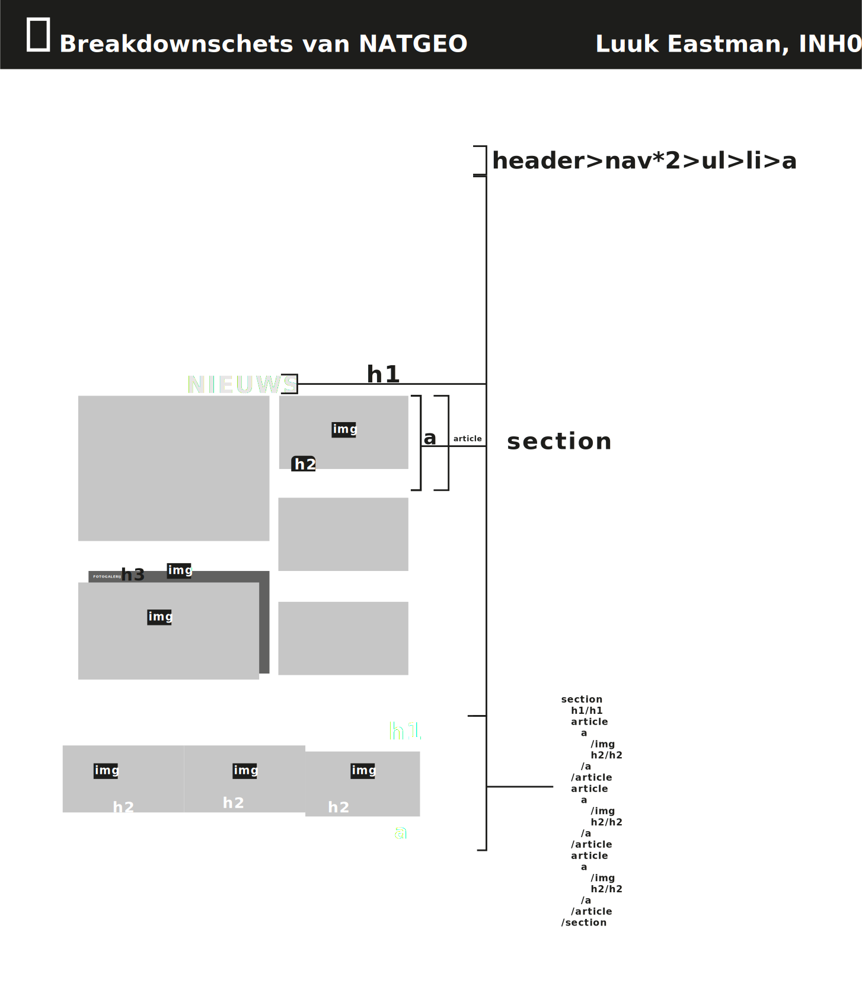
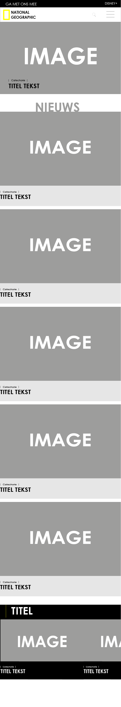
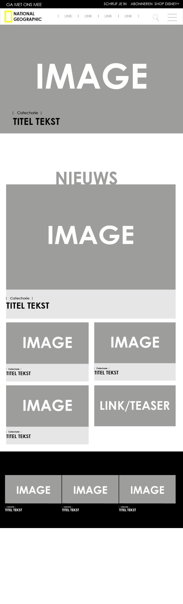
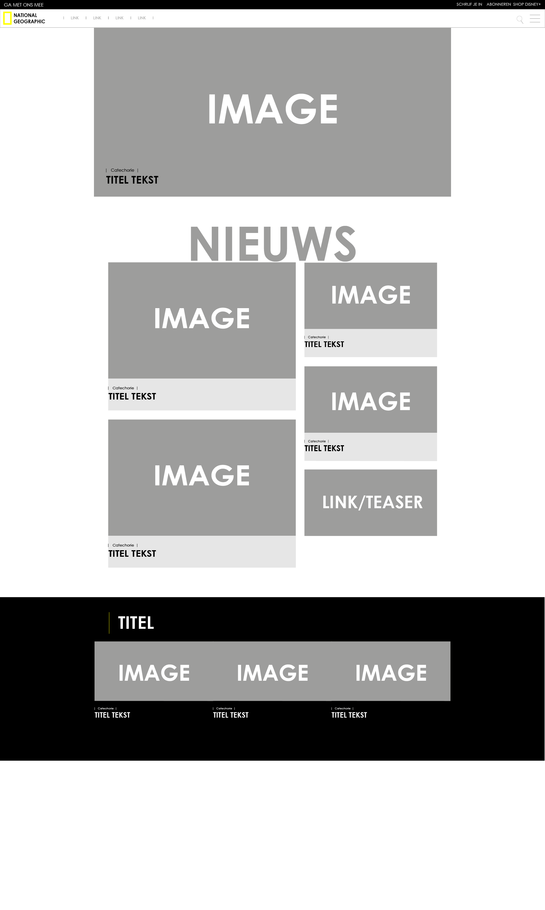

# Procesverslag
**Auteur:** Luuk Eastman

Markdown cheat cheet: [Hulp bij het schrijven van Markdown](https://github.com/adam-p/markdown-here/wiki/Markdown-Cheatsheet). Nb. de standaardstructuur en de spartaanse opmaak zijn helemaal prima. Het gaat om de inhoud van je procesverslag. Besteedt de tijd voor pracht en praal aan je website.

## Bronnenlijst
1. code gevonden op:https://cssgradient.io/blog/css-gradient-text/ voor een kleuroverloop in tekst*/ r240 van css
2. css tricks https://css-tricks.com/snippets/css/a-guide-to-flexbox/ voor algemene flexbox tips.
3. Media queries - oefening 3 uitwerking.
4. Sanne t Hoofd en Romy Wiedijk als student assistenten

## Eindgesprek (week 7/8)

IK had het niet helemaal af, maar was al op de goede weg. Sinds dit gesprek heb de header uitgebreid, content toegevoegd, te tweede pagina opgemaakt en wat ineracties toegevoegd.

## Voortgang 3 (week 6)

Ik was super aanwezig in de meeting met de twee studentassistenten: Romy en Jo-ann. De focus lag nog bij content toevoegen.

## Voortgang 2 (week 5)

Ik heb niet veel vooruitgang geboekt, maar ben nog steeds reuze gemotiveerd.

## Voortgang 1 (week 3)

### Verslag van meeting

Wat een positief gesprek, moet wel javascript in mijn site stoppen.

## Intake (week 1)

**IK ben een rode pistener, ik werk liever aan de website van een ander dan mijn eigen.

**De responsiveness van een website vind ik het leukst, dus daar wil ik mij op focussen.

**nationalgeographic.com

**Breakdown-schets(en):**

